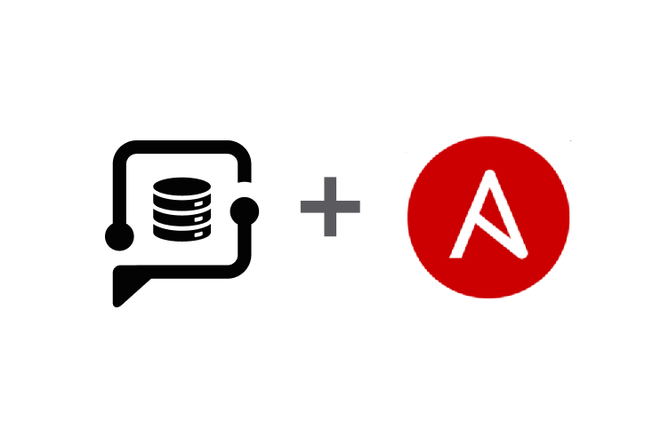

# PidginHost Collection

<div class="image-container">
  <p align="center">
    
  </p>
</div>


This repository contains the [`pidginhost.cloud`](https://galaxy.ansible.com/ui/repo/published/pidginhost/cloud/)
Ansible Collection.

## PidginHost Collection for Ansible

[]([https://galaxy.ansible.com/pidginhost/cloud])

This collection can be used to manage infrastructure in the [PidginHost](https://www.pidginhost.com/) cloud.
The PidginHost API documentation is located [here](https://www.pidginhost.com/api/schema/swagger-ui/).

## Code of Conduct

I follow the [Ansible Code of Conduct](https://docs.ansible.com/ansible/devel/community/code_of_conduct.html) in all my
interactions within this project.

If you encounter abusive behavior, please refer to
the [policy violations](https://docs.ansible.com/ansible/devel/community/code_of_conduct.html#policy-violations) section
of the Code for information on how to raise a complaint.

## External requirements

```text
requests
```

## Included content

| Module                                   | Description                                       |
|------------------------------------------|---------------------------------------------------|
| `pidginhost.cloud.firewall`              | Create firewalls rules set/add rules to rules set |
| `pidginhost.cloud.firewall_action`       | Add firewall                                      |
| `pidginhost.cloud.firewalls_info`        | Get firewalls                                     |
| `pidginhost.cloud.images_info`           | Get images                                        |
| `pidginhost.cloud.ip_action`             | Attach/detach IP from Server                      |
| `pidginhost.cloud.ips_info`              | Get ips info                                      |
| `pidginhost.cloud.packages_info`         | Get packages                                      |
| `pidginhost.cloud.profile_info`          | Get profile                                       |
| `pidginhost.cloud.public_interface_info` | Get public interface for specific server          |
| `pidginhost.cloud.server`                | Create or delete Servers                          |
| `pidginhost.cloud.server_action_power`   | Manage Servers action power                       |
| `pidginhost.cloud.server_action_resize`  | Resize a Server Volume or upgrade Server package  |
| `pidginhost.cloud.server_public_ip`      | Get specific server ip                            |
| `pidginhost.cloud.servers_info`          | Get all Servers info                              |
| `pidginhost.cloud.ssh_key`               | Manage SSH Keys                                   |
| `pidginhost.cloud.ssh_keys_info`         | Get SSH Keys info                                 |
| `pidginhost.cloud.volume`                | Add or Delete Volume                              |
| `pidginhost.cloud.volume_action`         | Attach or detach volume from Server               |
| `pidginhost.cloud.volumes_info`          | Get storage volumes                               |
| `pidginhost.cloud.volumes_products_info` | Get volumes Products                              |

| Inventory Plugin           | Description                      |
|----------------------------|----------------------------------|
| `pidginhost.cloud.servers` | Servers dynamic inventory plugin |


## Using this collection

There are sample playbooks in the [playbooks](playbooks) directory.

Be sure to set the `$PIDGINHOST_TOKEN` environment variable as all modules require authentication.
This is preferable in contrast to using the `token` module parameter in the play and storing your API token in plaintext
within your playbook.

> **Warning**
> Keep in mind, running the sample playbooks that create cloud resources will cost real money.

[This](playbooksrofile_info.yml) is a sample playbook which returns your PidginHost account information:

```yaml
---
- name: Get PidginHost profile info
  hosts: localhost
  connection: local
  gather_facts: false
  tasks:
    - name: Print all profile data
      pidginhost.cloud.profile_info:
        state: present
```

Output should look similar to the following:

```shell
❯ ansible-playbook -i localhost playbooks/profile_info.yml -v

PLAY [Get PidginHost profile info] ****************************************************************************************************************************************************************************

TASK [Print all profile data] *********************************************************************************************************************************************************************************
ok: [localhost] => changed=false 
  account:
    first_name: Web
    funds: '999856.80'
    last_name: Test
    phone: '0000000000'
  msg: Current account information

PLAY RECAP ****************************************************************************************************************************************************************************************************
localhost                  : ok=1    changed=0    unreachable=0    failed=0    skipped=0    rescued=0    ignored=0   
```


[This](inventoryidginhost.yml) is a sample inventory plugin file which returns the Servers in your account:

Output should look similar to the following:

```shell
❯ ansible-inventory -i inventory/pidginhost.yml --graph
@all:
  |--@ungrouped:
  |--@ubuntu:
  |  |--hhtest22332.com
  |--@status_active:
  |  |--hhtest22332.com
  |--@project_z5:
  |  |--hhtest22332.com

```

```shell
❯ ansible-inventory -i inventory/pidginhost.yml --host hhtest22332.com
{
    "ansible_host": "2.3.4.5",
    "ansible_user": "phuser",
    "cpus": 8,
    "disk_size": 200,
    "hostname": "hhtest22332.com",
    "id": 707,
    "image": "ubuntu22",
    "memory": 32,
    "networks": {
        "private": [],
        "public": {
            "interface": "eth0",
            "ipv4": "2.3.4.5",
            "ipv6": "22:33:44:1::22"
        }
    },
    "package": "cloudv-6",
    "project": "z5",
    "status": "active"
}

```

## Getting started creating a simple server

> [!NOTE]
> PidginHost does not require Server hostname to be unique - this functionality is enforced by the
> `pidginhost.cloud.server` module in conjunction with its `unique_hostname` parameter.


Get packages:
```shell
ansible localhost -m pidginhost.cloud.packages_info
```
Get images:
```shell
ansible localhost -m pidginhost.cloud.images_info
```

Next fill in the needed details like in the bellow example

"Only 'image' and 'package' are mandatory parameters. The other parameters are optional. You must provide 'password' or 'ssh_pub_key', or both. Failure to include either will result in an error, preventing the server creation."

Check documentation:

```shell
ansible-doc pidginhost.cloud.server
```

```yaml
---
- name: Create or delete Servers
  hosts: localhost
  tasks:
    - name: Create Server
      pidginhost.cloud.server:
        state: present
        unique_hostname: true
        image: string
        package: string
        hostname: string
        project: string
        password: string
        ssh_pub_key: string
        ssh_pub_key_id: string
        new_ipv4: true
        new_ipv6: true
        public_ip: string
        public_ipv6: string
        fw_rules_set: string
        fw_policy_in: ACCEPT
        fw_policy_out: ACCEPT
        private_network: string
        private_address: 198.51.100.42
        extra_volume_product: string
        extra_volume_size: 0
        no_network_acknowledged: true
```


### Installing the Collection from Ansible Galaxy

Before using this collection, you need to install it with the Ansible Galaxy command-line tool:

```shell
ansible-galaxy collection install pidginhost.cloud
```

You can also include it in a `requirements.yml` file and install it
with `ansible-galaxy collection install -r requirements.yml`, using the format:

```yaml
---
collections:
  - name: pidginhost.cloud
```

Note that if you install the collection from Ansible Galaxy, it will not be upgraded automatically when you upgrade
the `ansible` package.
To upgrade the collection to the latest available version, run the following command:

```shell
ansible-galaxy collection install pidginhost.cloud --upgrade
```

## More information

- [Ansible Collection overview](https://github.com/ansible-collections/overview)
- [Ansible User guide](https://docs.ansible.com/ansible/devel/user_guide/index.html)
- [Ansible Developer guide](https://docs.ansible.com/ansible/devel/dev_guide/index.html)
- [Ansible Collections Checklist](https://github.com/ansible-collections/overview/blob/main/collection_requirements.rst)
- [Ansible Community code of conduct](https://docs.ansible.com/ansible/devel/community/code_of_conduct.html)
- [The Bullhorn (the Ansible Contributor newsletter)](https://us19.campaign-archive.com/home/?u=56d874e027110e35dea0e03c1&id=d6635f5420)
- [News for Maintainers](https://github.com/ansible-collections/news-for-maintainers)

## Licensing

GNU General Public License v3.0 or later.

See [LICENSE](https://www.gnu.org/licenses/gpl-3.0.txt) to see the full text.

<style>
.image-container {
  max-width: 100%;
  height: auto;
}

@media screen and (max-width: 600px) {
  .image-container img {
    width: 100%;
  }
}
</style>