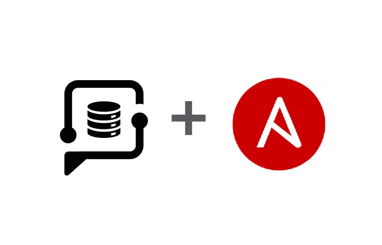

# PidginHost Cloud Ansible Collection



This repository contains the `pidginhost.cloud` Ansible collection used to provision and manage resources in the [PidginHost](https://www.pidginhost.com/) cloud. It ships production modules, a dynamic inventory plugin, and playbook templates that wrap the public API so you can automate server, volume, networking, and firewall workflows end to end.

## Requirements
- Python 3.9+ with Ansible 2.14 or newer (`meta/runtime.yml` specifies `>=2.14.0`).
- A valid PidginHost API token exported as `PIDGINHOST_TOKEN` or `PIDGINHOST_ACCESS_TOKEN`.
- Ability to reach `https://www.pidginhost.com/` from the control host; no additional Python dependencies are required.

## Repository Layout
| Path | Purpose |
| --- | --- |
| `plugins/modules/` | Collection modules for servers, firewalls, networks, volumes, IPs, and account data. |
| `plugins/module_utils/common.py` | Shared HTTP client, argument validation, and API helpers. |
| `plugins/inventory/servers.py` | Dynamic inventory plugin that maps PidginHost servers into Ansible hosts. |
| `playbooks/` | Ready-to-run examples such as `server.yml`, `profile_info.yml`, and `install-nginx.yml`. |
| `inventory/pidginhost.yml` | Inventory source configured for the dynamic plugin with JSON cache support. |
| `ansible.cfg` | Enables YAML callbacks for readable output. |
| `AGENTS.md` | Contributor workflow, coding style, and security expectations. |

## Installation & Packaging
```bash
# Install the published collection
ansible-galaxy collection install pidginhost.cloud

# Build from source inside this repo
ansible-galaxy collection build

# Install the local artifact for testing
ansible-galaxy collection install ./pidginhost-cloud-<version>.tar.gz -p ./collections
```

## Authentication
Export your API token before running modules or playbooks:
```bash
export PIDGINHOST_TOKEN=your-token-here
```
Passing the token as a playbook variable works, but environment variables keep secrets out of files and support the inventory plugin.

## Using the Modules
- Discover packages, images, and existing resources:
  ```bash
  ansible localhost -m pidginhost.cloud.packages_info
  ansible localhost -m pidginhost.cloud.images_info
  ansible localhost -m pidginhost.cloud.servers_info
  ```
- Create or delete servers via the sample playbook:
  ```bash
  ansible-playbook -i inventory/pidginhost.yml playbooks/server.yml \
    -e "server_state=present server_hostname=my-host.example server_image=ubuntu22 \
        server_package=cloudv-2 server_ssh_pub_key='ssh-ed25519 AAAA... user@example.com'"
  ```
- Resize, attach volumes, manage firewall rule sets, and assign IPs with dedicated modules such as `pidginhost.cloud.server_action_resize`, `pidginhost.cloud.volume`, `pidginhost.cloud.firewall`, and `pidginhost.cloud.ip_action`. Consult `ansible-doc <module>` for full argument specs.

## Dynamic Inventory
`plugins/inventory/servers.py` turns PidginHost servers into inventory hosts with cached facts and optional grouping:
```bash
ansible-inventory -i inventory/pidginhost.yml --graph
ansible-inventory -i inventory/pidginhost.yml --host my-host.example
```
By default each host exposes network details and sets `ansible_user` to `phuser`; adjust `attributes`, `compose`, or `groups` in `inventory/pidginhost.yml` as needed.

## Example Playbooks
- `playbooks/profile_info.yml` – verifies authentication and prints account data (safe smoke test).
- `playbooks/install-nginx.yml` – bootstraps an existing server using a temporary in-memory inventory entry.
- Additional playbooks demonstrate volume, firewall, and IP automation patterns; copy them when building integration tests.

## Testing & Linting
- Run collection sanity checks: `ansible-test sanity --python 3.11`.
- Lint example playbooks: `ansible-lint playbooks/*.yml`.
- Use `ansible-playbook -i localhost playbooks/profile_info.yml -v` to confirm connectivity without provisioning resources.

## Contributing
Follow the conventions in `AGENTS.md`: mirror snake_case filenames under `plugins/modules/`, reuse helpers from `module_utils/common.py`, and keep commit subjects short and imperative (e.g., `Add server resize helper`). Squash commits before PRs and document verification commands. Never commit real tokens—rely on environment variables or `ansible-vault`. Clear the `./tmp/` cache when switching tenants.

## License
Released under the GNU General Public License v3.0 or later. See [`LICENSE`](LICENSE) for the full text.
